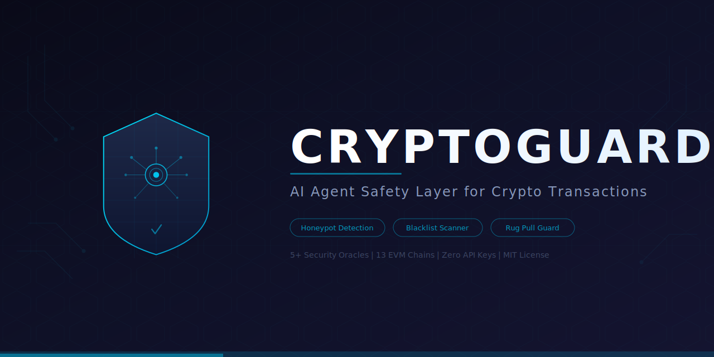

<p align="center">
  
</p>

<p align="center">
  <a href="https://pypi.org/project/cryptoguard-ai/"></a>
  <a href="https://github.com/momenbasel/CryptoGuard/blob/main/LICENSE"></a>
  <a href="https://github.com/momenbasel/CryptoGuard/stargazers"></a>
  <a href="https://pypi.org/project/cryptoguard-ai/"></a>
</p>

# CryptoGuard

**AI agent safety layer that prevents crypto scams before they happen.**

CryptoGuard is a pre-transaction hook for AI coding agents (Claude Code, Codex, Cursor, etc.) that automatically analyzes smart contracts before any crypto transaction is executed. It detects honeypots, blacklist functions, rug pulls, and scam tokens by cross-referencing multiple independent security oracles.

## The Problem

AI agents are increasingly used to execute crypto transactions - swapping tokens, interacting with DeFi protocols, and managing wallets. But they have no built-in safety layer to detect:

- **Honeypot tokens** - You can buy but never sell
- **Blacklist contracts** - The owner can freeze your funds after you buy
- **Rug pulls** - Liquidity can be removed instantly
- **Tax manipulation** - Fees can be changed to 100% after purchase
- **Airdrop scams** - Malicious tokens sent to bait interaction

**CryptoGuard stops these before a single wei leaves your wallet.**

## How It Works

```
You/AI Agent: "swap 1 ETH for TOKEN_X on Uniswap"
                    |
            [CryptoGuard Hook]
                    |
        +-----------+-----------+
        |           |           |
    GoPlus API   Bytecode    Reputation
    Security     Scanner     Aggregator
        |           |           |
        |     +-----------+    |
        |     | honeypot.is|   |
        |     | TokenSniffer|  |
        |     | De.Fi       |  |
        |     | QuickIntel  |  |
        |     +-----------+    |
        +-----------+-----------+
                    |
            Risk Score: 0-100
                    |
          SAFE -> Allow transaction
          HIGH -> BLOCK transaction
```

### Data Sources

CryptoGuard queries **5+ independent security oracles** in parallel:

| Source | What it checks |
|--------|---------------|
| **GoPlus Security** | Honeypot, blacklist, tax, ownership, holders, liquidity |
| **Honeypot.is** | Buy/sell simulation on forked chain state |
| **TokenSniffer** | Automated audit score, similar known scams |
| **De.Fi Scanner** | DeFi protocol security issues |
| **QuickIntel** | Multi-chain token intelligence |
| **Bytecode Scanner** | Dangerous opcodes, blacklist selectors, proxy patterns |

### What It Detects

| Risk | Description | Severity |
|------|-------------|----------|
| Honeypot | Cannot sell tokens after buying | CRITICAL |
| Blacklist | Owner can freeze any address | CRITICAL |
| Balance manipulation | Owner can change anyone's balance | CRITICAL |
| Airdrop scam | Malicious token sent to bait interaction | CRITICAL |
| Self-destruct | Contract can destroy itself and drain funds | CRITICAL |
| Per-address tax | Owner can set 100% tax on YOUR address | CRITICAL |
| Cannot sell all | Trapped partial balance | CRITICAL |
| Extreme sell tax | >50% sell tax | CRITICAL |
| Hidden owner | Concealed admin control | HIGH |
| Unlocked liquidity | LP can be pulled (rug pull) | HIGH |
| Unverified source | Code not published for audit | HIGH |
| Whale concentration | Single wallet holds >20% supply | HIGH |
| Creator honeypot history | Deployer made honeypots before | HIGH |
| Modifiable tax/slippage | Fees can be changed post-buy | HIGH |
| Pausable transfers | Owner can halt all trading | HIGH |
| Proxy contract | Logic can be silently upgraded | MEDIUM |
| Mintable supply | New tokens can dilute holdings | MEDIUM |
| Low liquidity | High slippage or unable to sell | MEDIUM |
| Similar scam tokens | Code matches known scams | HIGH |

## Quick Start

### Install

```bash
pip install cryptoguard-ai-ai
```

### Install the AI Agent Hook (recommended)

```bash
# Automatically installs the Claude Code pre-transaction hook
cryptoguard install-hook

# Or with custom risk threshold
cryptoguard install-hook --threshold CRITICAL  # Only block critical risks
cryptoguard install-hook --threshold MEDIUM    # Block medium and above
```

### One-Line Install

```bash
pip install cryptoguard-ai && cryptoguard install-hook
```

### Manual Check

```bash
# Check a token on Ethereum
cryptoguard check 0xdAC17F958D2ee523a2206206994597C13D831ec7 --chain ethereum

# Check on BSC
cryptoguard check 0x... --chain bsc

# JSON output (for scripts)
cryptoguard check 0x... --chain polygon --output json

# Quick check (just risk level, for scripting)
cryptoguard check 0x... -q
echo $?  # 0=safe, 1=medium, 2=high/critical
```

## Integration

### Claude Code (Automatic)

After `cryptoguard install-hook`, every `cast send`, `swap`, `approve`, and other transaction commands are automatically intercepted and analyzed.

The hook adds this to your `~/.claude/settings.json`:

```json
{
  "hooks": {
    "PreToolUse": [
      {
        "matcher": "Bash",
        "hook": "python -m cryptoguard.hook"
      }
    ]
  }
}
```

### OpenAI Codex / Other Agents

Use CryptoGuard as a pre-exec wrapper:

```bash
# Wrap any command
cryptoguard check 0xTOKEN_ADDRESS --chain ethereum -q && cast send 0xTOKEN_ADDRESS ...
```

Or use the MCP server for tool-based integration:

```bash
# Start MCP server (stdio transport)
cryptoguard serve
```

### Python API

```python
from cryptoguard import analyze

result = analyze("0xdAC17F958D2ee523a2206206994597C13D831ec7", chain="ethereum")

print(f"Risk: {result.risk_level.value} ({result.risk_score}/100)")
print(f"Safe: {result.is_safe}")
print(f"Should block: {result.should_block}")

for finding in result.findings:
    print(f"  [{finding.severity.value}] {finding.title}")
```

### MCP Server

Add to your Claude Code MCP config or any MCP-compatible client:

```json
{
  "mcpServers": {
    "cryptoguard": {
      "command": "python",
      "args": ["-m", "cryptoguard.mcp_server"]
    }
  }
}
```

## Configuration

### Environment Variables

| Variable | Description | Default |
|----------|-------------|---------|
| `CRYPTOGUARD_DISABLE` | Set to `1` to bypass the hook | `0` |
| `CRYPTOGUARD_CHAIN` | Default chain if not detected | `ethereum` |
| `CRYPTOGUARD_THRESHOLD` | Min risk level to block (`CRITICAL`, `HIGH`, `MEDIUM`) | `HIGH` |

### Supported Chains

Ethereum, BSC, Polygon, Arbitrum, Base, Optimism, Avalanche, Fantom, zkSync Era, Linea, Scroll, Mantle, Blast

## Architecture

```
cryptoguard/
  __init__.py       # Public API
  cli.py            # Click CLI (check, install-hook, serve)
  hook.py           # AI agent pre-transaction hook
  analyzer.py       # Core analysis engine + risk scoring
  scanner.py        # EVM bytecode pattern analysis
  goplus.py         # GoPlus Security API client
  reputation.py     # Multi-source reputation aggregator
  report.py         # Terminal report formatter (Rich)
  mcp_server.py     # MCP server for tool-based integration
  constants.py      # Chains, selectors, weights
```

### Risk Scoring

Risk score is 0-100, computed from weighted findings with diminishing returns within categories:

| Score | Level | Action |
|-------|-------|--------|
| 70-100 | CRITICAL | Block transaction, show full report |
| 50-69 | HIGH | Block transaction, show findings |
| 30-49 | MEDIUM | Warn, allow with caution |
| 15-29 | LOW | Info only |
| 0-14 | SAFE | Allow silently |

Multiple sources confirming the same risk increase confidence. Trust-listed tokens get a score reduction.

## Development

```bash
git clone https://github.com/momenbasel/CryptoGuard.git
cd CryptoGuard
pip install -e ".[dev]"

# Run tests
pytest

# Lint
ruff check .
```

## FAQ

**Does this slow down my transactions?**
Analysis takes 2-5 seconds (parallel API calls). This runs only when a crypto transaction is detected, not on every command.

**Does it need API keys?**
No. All security oracles used have free public tiers. No API keys required.

**Can it detect all scams?**
No tool can guarantee 100% detection. CryptoGuard significantly reduces risk by cross-referencing multiple independent sources, but novel scam techniques may bypass detection. Always DYOR.

**Does it work with hardware wallets?**
CryptoGuard analyzes the contract, not the wallet. It works regardless of how you sign transactions.

**Can I use it without an AI agent?**
Yes. The CLI works standalone: `cryptoguard check 0x... --chain ethereum`

## License

MIT

## Credits

Built by [@momenbasel](https://github.com/momenbasel). Security data powered by GoPlus, Honeypot.is, TokenSniffer, De.Fi, and QuickIntel.

---

**If this tool saves you from a scam, star the repo and share it. Every star helps protect more people.**
